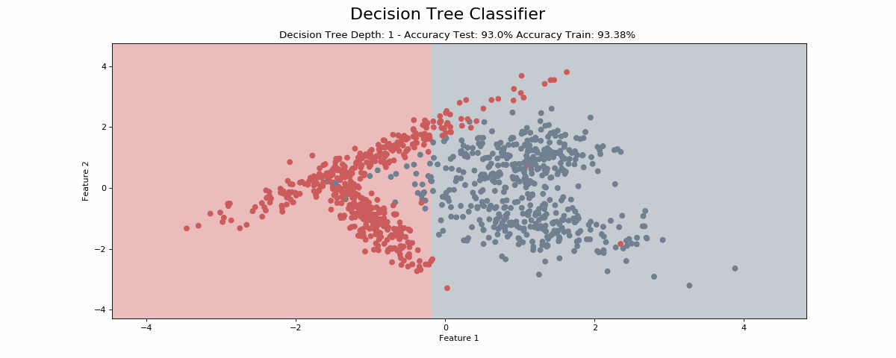
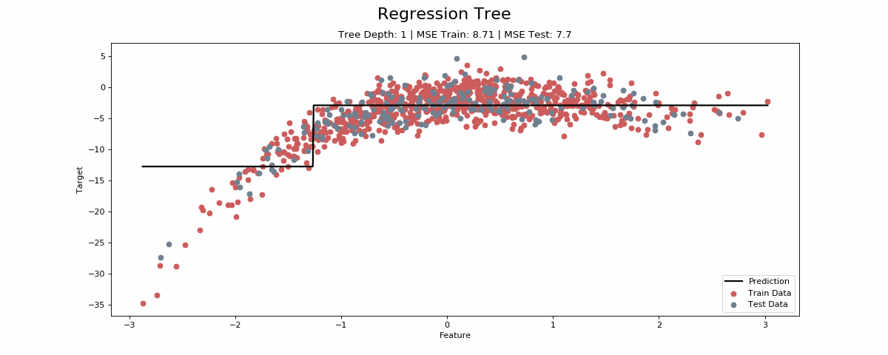
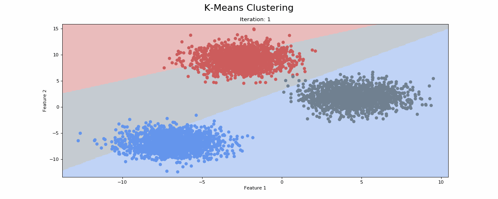
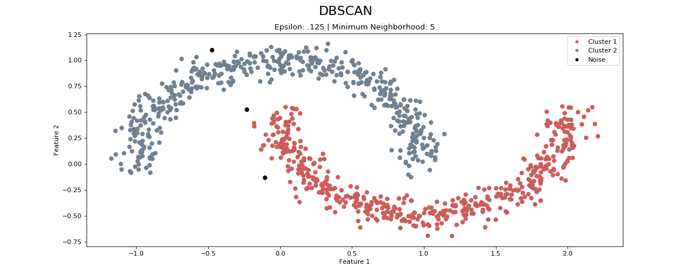
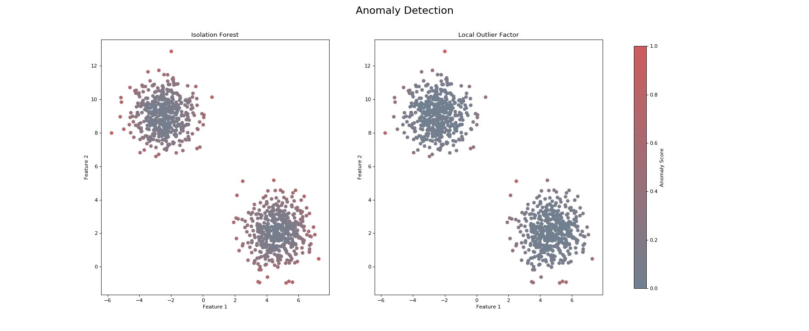

# Machine Learning - CLI5

Personal project coding the various ML models.

# Table of Contents

## 1. Supervised

### 1.1. Classification
#### 1.1.1. Logistic Regression
#### 1.1.2. Decision Tree Classifier

  

#### 1.1.3. K-Nearest Neighbour
#### 1.1.4. Adaptive Boosting
#### 1.1.5. Random Forest Classifier

### 1.6. Regression
#### 1.6.1 Linear Regression

  

#### 1.6.2 Lasso Regression
#### 1.6.3 Ridge Regression
#### 1.6.4 Elastic Net
#### 1.6.5 Polynomial Regression

  

#### 1.6.6. Decision Tree Regressor

  

#### 1.6.7. Random Forest Regressor

## 2. Unsupervised
### 2.1 Clustering
#### 2.1.1. K-Means Clustering

  

#### 2.1.2. DBSCAN

  

### 2.2. Anomaly Detection

  

### 2.3. Data Transformation
#### 2.3.1. Principal Components Analysis

## 3. Optimisation
### 3.1. Genetic Algorithm

## Requirements
* Python 3
* Numpy
* Math

## Cloning 
To run the code, clone this GIT repository:

`git clone https://github.com/SaadChaouki/ml-eli5-cli5.git`

## Author
* Saad Chaouki - sd.chaouki@gmail.com
